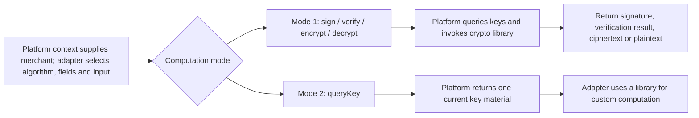

# Institution Security: Adapter-Defined Protocol, Platform-Owned Key Queries

## 1. Keep the two security boundaries separate

The platform entry layer and gateway integration handle iPay-to-platform signatures and verification. Adapters implement signing, verification, encryption and decryption for the platform-to-institution protocol. Do not change `DefaultSecurityProcessor` to adapt an institution, depend directly on the IBCM client or assemble key-query conditions yourself.

The SDK exposes six methods through `PlatformChannelSecurityService`: sign, verify, encrypt, decrypt, digest and queryKey.
See the [security API reference](reference/security.md) for each method's request/response tables.

## 2. Two integration modes

| Responsibility | Mode 1: platform computation | Mode 2: adapter computation |
| --- | --- | --- |
| Field selection, ordering, concatenation and character encoding | Adapter | Adapter |
| merchantId source | Platform invocation context | Platform invocation context |
| IBCM lookup, subject construction and current-key selection | Platform | Platform |
| Algorithm execution | Platform-integrated crypto library | Mature library selected by the adapter |
| Key material enters adapter code | Not required | Returned for computation within the adapter process |
| Place results in headers/body | Adapter | Adapter |
| Stop processing on verification failure | Required in adapter | Required in adapter |

Both modes are available. Mode 2 does not transfer key-query ownership to the adapter; queries still use the platform API.
`queryKey` returns one actual key material, not an opaque key handle.

## 3. Merchant identity and key lookup

Business calls supply merchantId only, not subjectId, issuer, holder, tenant or version. The platform constructs `AIS_ALIPAY_ + merchantId` and queries the currently valid key.
The returned keyVersion identifies the material used; it does not allow callers to select a historical version. There is no automatic retry with historical keys.

Read the value with `ChannelRequestContext.current().getMerchantId()`. The platform Facade binds channel, merchant and runtime environment before invocation and clears them afterward. The adapter must not select key identity from business JSON, `Order.merchant` or institution Client-Id. Generated security wrappers populate merchantId; developers supply protocol input, signatures and runtime cipher parameters.

Missing context or merchant fails immediately; there is no default-merchant fallback. Isolated unit tests simulate platform context with synthetic values. Do not call `bind/clear` in production adapter code. See [invocation context](reference/context.md).

| Operation/material | issuer | holder |
| --- | --- | --- |
| Platform private key: asymmetric signing/decryption | DEFAULT | DEFAULT |
| Institution public key: asymmetric verification/encryption | AIS_ALIPAY_ + merchantId | DEFAULT |
| Symmetric key | Empty | Empty |
| Internal platform-public-key query rule | DEFAULT | AIS_ALIPAY_ + merchantId |

The final row documents an internal lookup convention; **queryKey does not expose an additional platform-public-key selection parameter**. The public API determines material type from purpose and keyAlgorithm.
The security service still receives explicit merchantId and checks that it is nonblank; this does not add merchant-ownership authorization. The platform binds context, and the institution Client-Id-to-merchant relationship still requires integration confirmation.

## 4. Signing and verification protocol rules

Convert institution signing specifications into explicit byte/text rules:

- Included headers, fields and paths; case, ordering, separators and trailing newline.
- Whether serialized JSON exactly matches the content sent.
- Whether GET includes a body digest and whether dynamic paths are signed before or after substitution.
- Where Base64, Hex and URL encoding occur; do not encode twice.
- Signature prefix, placement and extraction of verification input.

For example, Base64 HMAC and HEX HMAC used in institution protocols are different string representations. `HMAC_SHA256` preserves IBCM's native HEX output; `HMAC_SHA256_BASE64` returns Base64. Do not substitute one merely because the names are similar.

Platform signing and verification delegate to IBCM SignatureUtil sign/check. The SDK exposes 16 signing algorithms; see the security reference for the complete list. Availability does not guarantee compatibility with every institution protocol.
IBCM check may return false for either a signature mismatch or an internal computation error; parameter and key-query errors may still throw.

Verify notifications and responses against original text, not JSON.parse followed by toJSONString. The inbound carrier is String; protocols requiring strict raw-byte verification must confirm the decoding boundary with the platform.

## 5. Encryption and decryption scope

| Capability | Implementation | Integration constraints |
| --- | --- | --- |
| AES, DES, DESede, SM4, SM4_BOCSZ | IBCM EncryptHelper | Explicit mode/padding; IV where required; GCM also needs tagBitLength and optional AAD |
| RSA2 | IBCM EncryptHelper | ECB and explicit padding; RSA2 key registration does not mean encryption performs SHA256 signing |
| PGP | IBCM encryptPlus/decryptPlus | Supply pgp parameters; platform retrieves keys and private-key passphrases |
| CMS_DESded, CMS_BASE64_DESded | IBCM CMS envelope | Institution certificate and algorithm-native encoding requirements |
| SM2, SM2_CBMC, SM2_CITICSH | Corresponding IBCM protocols | Check certificate/material and ciphertext-format differences individually |
| digest | SHA256/SHA384/SHA512; BASE64/HEX | Unkeyed digest, not identity authentication |

See [security APIs](reference/security.md) for encodings and parameter applicability. Do not assume ciphertext embeds an IV or that decryption always returns business plaintext.
The adapter prepares the IV per protocol. Never reuse a nonce under the same GCM/CTR key; the platform does not automatically prepend it to ciphertext. Do not pass irrelevant algorithm parameters.
Use mode 2 for other institution protocols when appropriate. Key-query, signing and cipher algorithm catalogs are independent.

## 6. Scaffold integration points

| Extension point | Required implementation |
| --- | --- |
| protectRequestToChannel | Encrypt/digest/sign the final payload; place results in institution headers or body |
| unprotectResponseFromChannel | Extract signature, verify and decrypt per protocol; return mappable text |
| unprotectNotificationFromChannel | Verify/decrypt before trusting notification business fields; stop on failure |
| Typed operation requests and result-placement hooks | Implement the selected platform-computation or queryKey branch; populate cipher parameters, runtime IV/AAD/PGP as applicable |

Scaffold creation asks only two global yes/no questions, recorded in `securityFeatures.signature` and `securityFeatures.encryption`. Signature generates request-signing and response/notification-verification examples; encryption generates request-encryption and response/notification-decryption examples. Enabled examples call platform APIs through typed protocol hooks that initially throw. Disabled features perform no computation. The booleans are not an algorithm, operation-order or institution-rule declaration.

Complete actual inputs, algorithms, parameters, result placement and order during implementation, choosing platform or custom adapter computation then. Do not treat demonstration defaults or generated tests as protocol evidence. Advanced per-method `security` JSON remains an alternative for already specified rules; its explicit none choice must not conceal missing implementation requirements.

## 7. Key and sensitive-data rules

`SecurityKeyMaterial.value` preserves the managed system's storage format; the response has no codeType field. Confirm the actual PEM/DER/Base64 representation with the platform. Do not guess or decode repeatedly.
Excluding value from toString does not prevent leakage through a getter or JSON serialization.

Do not put keys, complete card credentials or sensitive signing-input fields in logs, exception messages, mapping documents or test snapshots. Use synthetic data and test keys.
SDK-provided Tink/Hutool does not allow arbitrary packaged versions: the host shares a classpath, so versions must match the platform. Confirm notification verification during key rotation in integration testing; do not try historical keys or skip verification on your own.

Evidence: PlatformChannelSecurityService, DefaultPlatformChannelSecurityService, IbcmSignatureOperations, ChannelSecurityCustomization, platform adapter/keyquery and cipher implementations.
