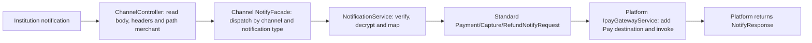

# Notifications and Browser Callbacks

## 1. Notification SPI output is not an acknowledgment



The adapter converts institution semantics into standard iPay notification semantics. The platform owns iPay forwarding, domain, path and iPay security protocol.
`NotificationService.notifyPayment` returns `PaymentNotifyRequest`, not `NotifyResponse` or a string ACK; the same applies to capture/refund.

## 2. Three connected entry points

| Platform HTTP entry point: POST | Adapter method | DTO returned to platform |
| --- | --- | --- |
| /{channelCode}/channel/notifyPayment/{merchantId} | notifyPayment | PaymentNotifyRequest |
| /{channelCode}/channel/notifyCapture/{merchantId} | notifyCapture | CaptureNotifyRequest |
| /{channelCode}/channel/notifyRefund/{merchantId} | notifyRefund | RefundNotifyRequest |

The platform stores institution text in `BaseChannelRequest.rawBody`, collects requestHeaders and sets merchantaccount from the path merchantId.
The Facade uses this to bind [ChannelRequestContext](reference/context.md). Adapters construct security requests using current().getMerchantId(), not unverified notification-body identity. The platform clears context afterward.
Payment notifications may populate String extendInfo from confirmed business mappings; do not append arbitrary raw payloads by default.
Notification input reuses BaseChannelRequest but does not select an outbound institution route. The presence of domain/path on the base type does not mean they are populated for notifications.
Construct verification input's inbound path from the confirmed public path and substituted parameters, not an unpopulated channel egress path.
Headers are currently a single-value Map, which does not guarantee preservation of every repeated header. Confirm platform boundaries for protocols requiring multi-value headers, raw bytes or the URI before proxy rewriting.

The public notification URL registered in an institution console is a platform/institution integration setting, not an adapter-selected public domain.
Verification Request-Target must be the complete substituted path actually called by the institution.

<a id="callback-sandbox-contract"></a>

### Callback sandbox contract

Sandbox callbacks use the same entry-point paths with `isSandbox=true` in the URL:

```text
/{channelCode}/channel/notifyPayment/{merchantId}?isSandbox=true
/{channelCode}/channel/notifyCapture/{merchantId}?isSandbox=true
/{channelCode}/channel/notifyRefund/{merchantId}?isSandbox=true
/{channelCode}/channel/acsUrlCallback?isSandbox=true
```

Use `&isSandbox=true` when the confirmed URL already has query parameters. A missing, empty or false value means ordinary traffic; an invalid Boolean is rejected with HTTP 400. On these four callback paths, the query decision takes precedence over inbound `loadMode` and `markuid` headers. Other business entry points still use `loadMode=2`. Sandbox recognition is not restricted to prod.

The platform sets its request context, log marker and Tracer attributes before business execution. It removes conflicting inbound sandbox headers and rebuilds `loadmode=2` plus `markuid=0A` when forwarding a sandbox callback to iPay. The iPay domain remains the configured base address. ACS forwards only its business query parameters to iPay; `isSandbox` is consumed by the platform and represented by these headers downstream.

**Adapter responsibility is URL preservation, not sandbox recognition.** Map the complete callback URL supplied under the confirmed integration contract into the institution field, including existing query parameters. If it is registered in the institution console instead, verify that the registered sandbox URL contains the parameter. The platform does not currently generate these public callback URLs or append the parameter automatically. Do not add an `isSandbox` DTO field, callback SPI, scaffold question or sandbox branch to the adapter. Do not infer sandbox from `runtimeEnv`.

Signing rules still come from the institution protocol. Preserving a callback URL does not imply including its query string in Request-Target; verify the path/query rule against the actual public address and proxy behavior.

## 3. Implementation steps

1. Extract platform-provided merchant identity, institution signature headers, timestamps and similar inputs. Do not trust arbitrary business-body overrides of routing identity.
2. In `unprotectNotificationFromChannel`, verify/decrypt per institution protocol and stop on failure.
3. Validate agreed event type, transaction references, amount, status and other fields.
4. Construct the corresponding standard notification DTO, set result and business fields, and retain headers required by subsequent platform processing.
5. Return a non-null object for platform forwarding. Do not issue another iPay call in the adapter.

For selected notifyPayment/notifyCapture/notifyRefund, the CLI generates SPI wiring with an anonymous ChannelNotificationExtension inside each method. There are no notification Mapping helper classes. Business and enabled security rules remain to be implemented. Refund notification does not automatically select the refund or refund-inquiry transaction.
Optional SDK methods notifyOnlineBankPayment/notifyReceivePayment have no complete platform API path and must not be registered or advertised as operational. The CLI does not generate their implementations or operation constants.
Vault/Dispute SPIs and their notification entry points are not supported.

## 4. iPay destination composition

| Type | Platform-fixed path template |
| --- | --- |
| Payment notification | /api/open/ais/{aisGroup}/{channelId}/card/notifyPayment.htm |
| Capture notification | /api/open/ais/{aisGroup}/{channelId}/card/notifyCapture.htm |
| Refund notification | /api/open/ais/{aisGroup}/{channelId}/card/notifyRefund.htm |
| ACS callback | /api/open/url_callback_short_get/ais/{aisGroup}/acsUrlCallBack.htm |

The domain comes from `DomainControlConfig.ipayDomain`; aisGroup/channelId come from module `IpayChannelIdentity`.
Do not replace card or DOKU identifiers with guessed gateway APIs. Other product flows require platform confirmation.
DOKU Card/APM currently both use DOKU2025 / doku; this is not the default identity for other institutions.

## 5. Confirm acknowledgment, retries and idempotency

The Controller returns `NotifyResponse` as JSON; it does not write responseText directly as the institution HTTP body.
A required fixed string, empty body, special status code or response signature may not be supported by the generic entry point. Confirm with the platform rather than returning a different type from the notification SPI.
Tests must cover duplicate/out-of-order notifications, timeout redelivery and forwarding-failure acknowledgment.
Do not assume the platform persists idempotency records or mistake a template header for idempotency storage.

## 6. ACS browser callback

The platform directly forwards `GET /{channelCode}/channel/acsUrlCallback` to iPay, reads `iopengwSystemInnerRedirectionUrl` and returns 302 Location. The optional `isSandbox` query parameter follows the [callback contract](#callback-sandbox-contract); it does not create adapter logic or change the three business parameters forwarded to iPay.
This entry point is platform-owned and does not invoke an adapter SPI. The SDK no longer declares a callback SPI; `AcsUrlCallbackRequest` and `AcsUrlCallbackResponse` belong to `sdk.api.gateway.request/response`. The CLI does not generate callback implementations or operation constants.

Location must be a valid absolute HTTP/HTTPS URL with a host and without userinfo; missing/invalid values produce 502. This is a browser redirect, not a server-side fetch by the platform.
`onlineBankUrlCallback` has been removed from the SDK and has no connected platform entry point. Do not generate an implementation or reuse the ACS URL for it.
For encoded parameters such as signData, verify encoding counts with end-to-end examples; logged string representations do not establish identical original values.

Evidence: ChannelController, NotifyFacadeSupport, IopengwClient, IpayGatewayRoutes, IpayChannelIdentity, NotificationService and CLI anonymous notification-extension templates.
